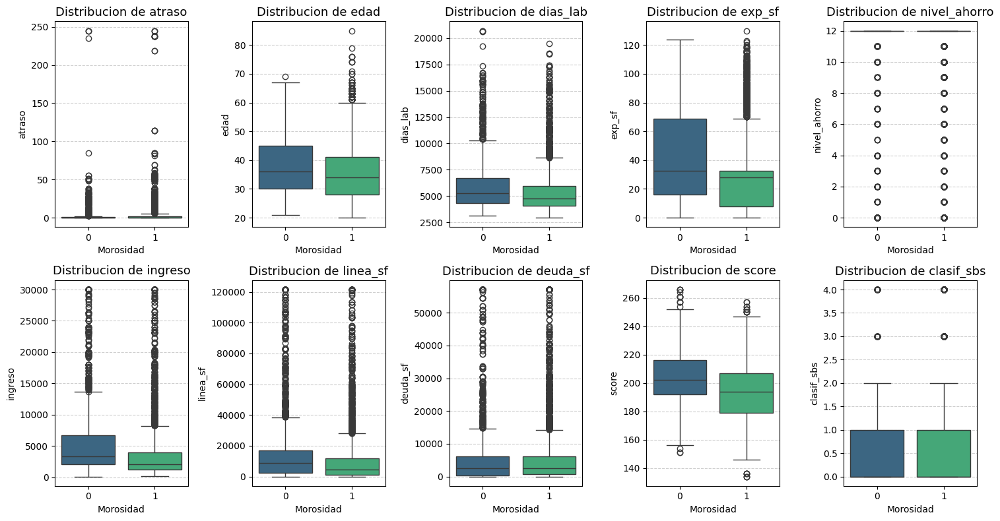
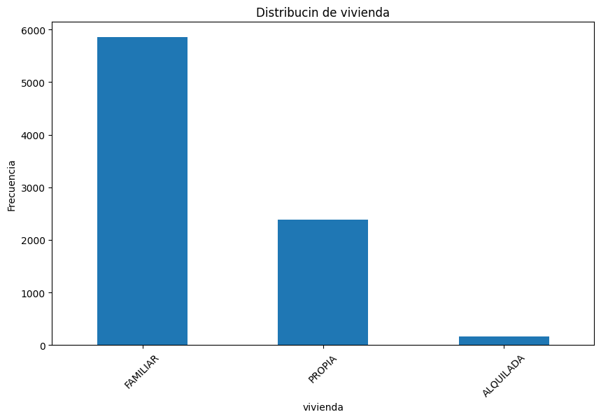
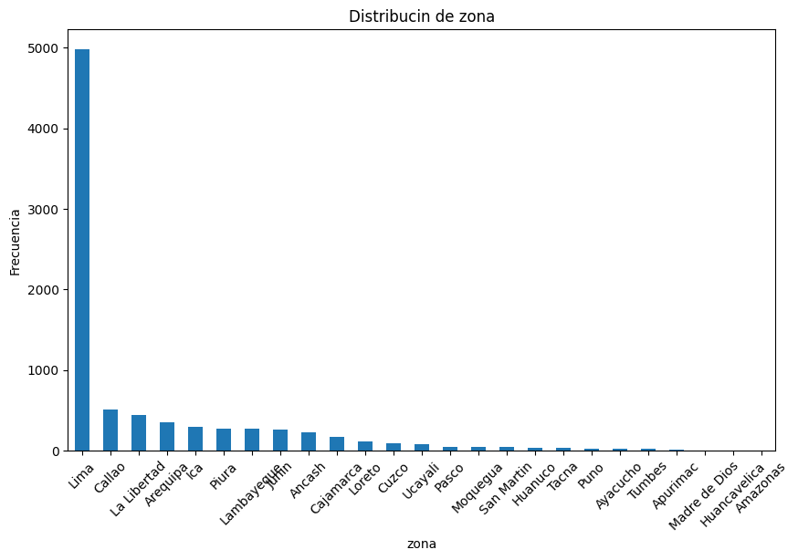
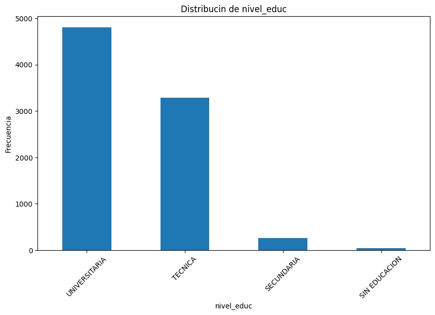
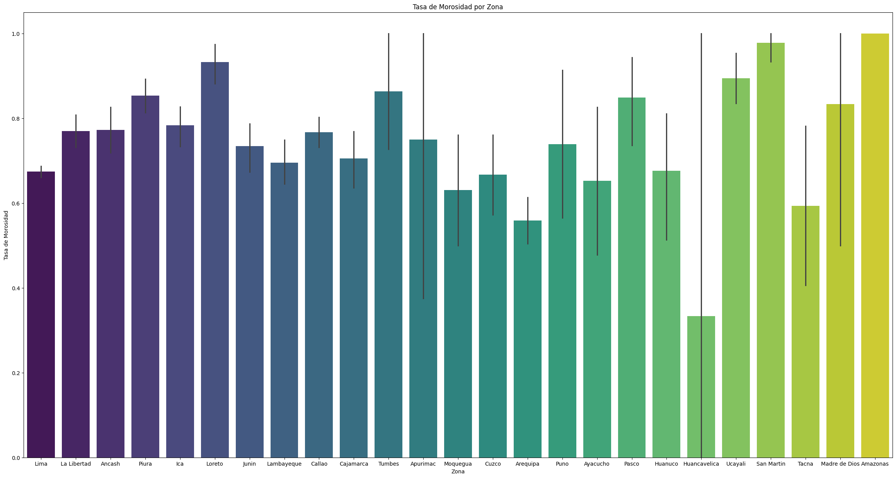
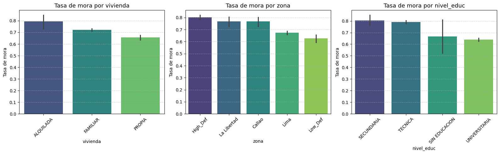
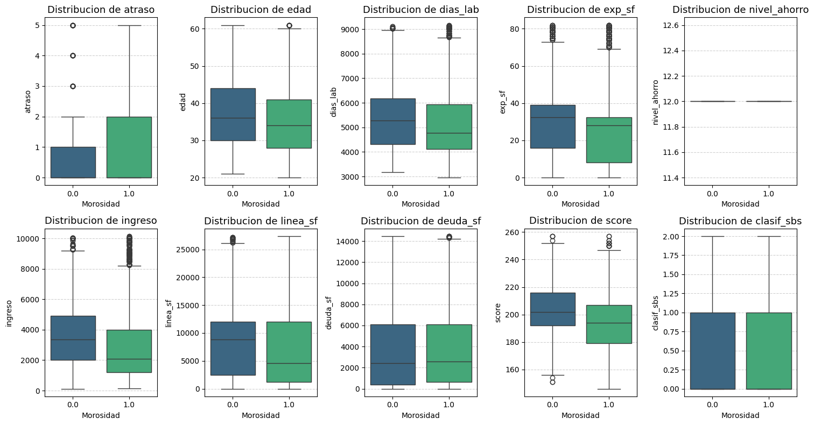
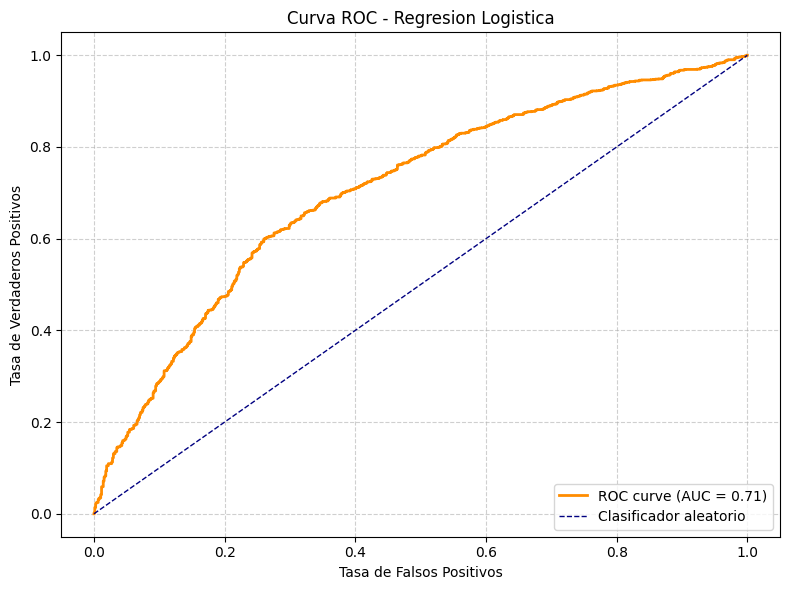
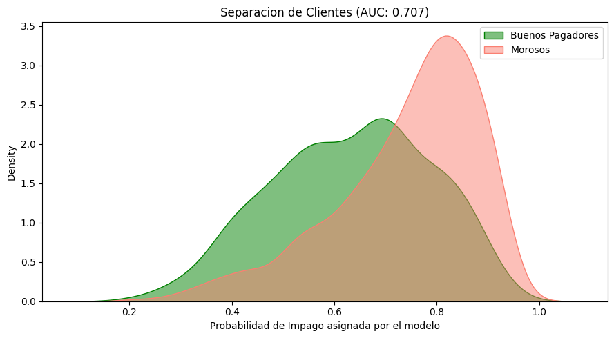
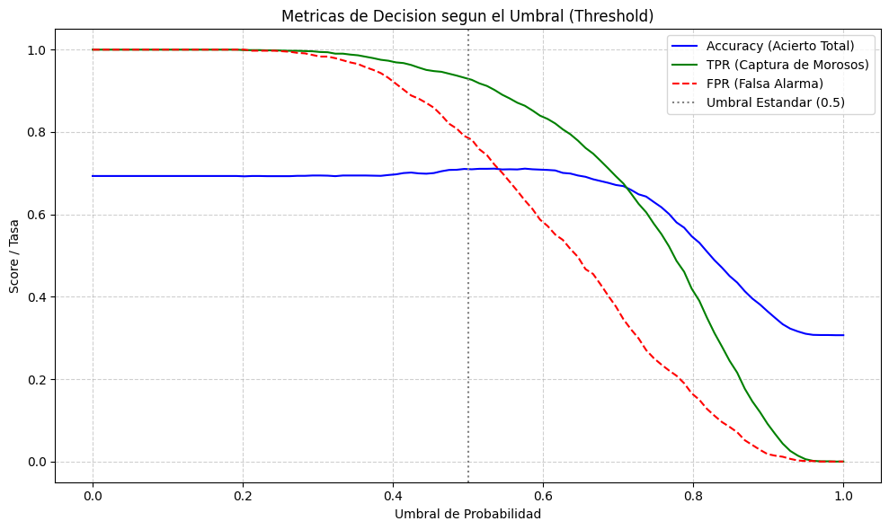

# Prediccion de Morosidad Crediticia

Este proyecto aborda un problema clasico del sector financiero: anticipar que clientes tienen mayor probabilidad de incurrir en mora antes de que esto ocurra. A traves de un analisis exploratorio riguroso y la aplicacion de distintos modelos de clasificacion, se busca construir una herramienta que permita a una entidad crediticia tomar decisiones mas informadas en la concesion y seguimiento de prestamos.

---

## Indice

1. [Contexto y motivacion](#contexto-y-motivacion)
2. [Dataset](#dataset)
3. [Analisis exploratorio](#analisis-exploratorio)
4. [Tratamiento de datos](#tratamiento-de-datos)
5. [Ingenieria de variables](#ingenieria-de-variables)
6. [Preprocesamiento](#preprocesamiento)
7. [Modelado y resultados](#modelado-y-resultados)
8. [Conclusiones](#conclusiones)
9. [Tecnologias utilizadas](#tecnologias-utilizadas)

---

## Contexto y motivacion

La morosidad es uno de los principales riesgos a los que se enfrenta cualquier institucion financiera. Identificar de forma temprana a los clientes con mayor riesgo de impago permite actuar preventivamente, ya sea ajustando las condiciones del credito, reforzando el seguimiento o limitando la exposicion. El dataset utilizado proviene de una entidad financiera peruana y recoge informacion socioeconomica y de comportamiento crediticio de **8.399 clientes**.

---

## Dataset

### Variables

| Variable | Tipo | Descripcion |
|----------|------|-------------|
| `mora` | Binaria | Variable objetivo: 1 = moroso, 0 = cumplidor |
| `atraso` | Numerica | Dias de atraso en pagos |
| `vivienda` | Categorica | Tipo de vivienda del cliente |
| `edad` | Numerica | Edad del cliente |
| `dias_lab` | Numerica | Dias en activo laboral |
| `exp_sf` | Numerica | Meses de experiencia en el sistema financiero |
| `ingreso` | Numerica | Ingreso mensual declarado |
| `linea_sf` | Numerica | Linea de credito disponible |
| `deuda_sf` | Numerica | Deuda vigente en el sistema financiero |
| `score` | Numerica | Puntuacion crediticia |
| `zona` | Categorica | Region geografica del cliente |
| `clasif_sbs` | Numerica | Clasificacion segun la Superintendencia de Banca y Seguros |
| `nivel_educ` | Categorica | Nivel educativo alcanzado |

### Estadisticas descriptivas

Las primeras filas del dataset muestran la diversidad de perfiles:

| mora | atraso | vivienda | edad | dias_lab | exp_sf | ingreso | linea_sf | deuda_sf | score |
|------|--------|----------|------|----------|--------|---------|----------|----------|-------|
| 0 | 235 | FAMILIAR | 30 | 3748 | 93.0 | 3500 | NaN | 0.00 | 214 |
| 0 | 18 | FAMILIAR | 32 | 4598 | 9.0 | 900 | 1824.67 | 1933.75 | 175 |
| 0 | 0 | FAMILIAR | 26 | 5148 | 8.0 | 2400 | 2797.38 | 188.29 | 187 |

### Valores nulos detectados

Antes del tratamiento, tres variables presentaban datos ausentes:

| Variable | Nulos |
|----------|-------|
| `exp_sf` | 1.830 |
| `linea_sf` | 1.127 |
| `deuda_sf` | 461 |
| Resto | 0 |

Tras la imputacion por la media, todas las variables quedaron completas:

| Variable | Nulos (tras imputacion) |
|----------|------------------------|
| Todas | **0** |

---

## Analisis exploratorio

### Distribucion de variables numericas — Boxplots por clase de mora

Los boxplots permiten comparar la distribucion de cada variable numerica entre clientes morosos (1) y no morosos (0), revelando diferencias en medianas, dispersion y presencia de valores extremos.

Se observa que variables como `atraso`, `deuda_sf` y `score` presentan diferencias notables entre ambas clases, lo que anticipa su relevancia predictiva. La presencia de outliers es significativa en varias de ellas.

### Distribucion de variables categoricas

Se analizo la frecuencia de cada categoria en las tres variables cualitativas del dataset.

**Tipo de vivienda:**

**Zona geografica:**

**Nivel educativo:**

La mayoria de clientes residen en Lima y declaran vivienda familiar. Se aprecia una concentracion importante en pocas zonas geograficas, lo que motiva el tratamiento posterior de zonas con baja representacion.

### Tasa de morosidad por zona geografica

El grafico muestra la tasa media de mora por region. Zonas como Amazonas, Loreto y San Martin presentan las tasas mas elevadas, mientras que Huancavelica y Arequipa se situan en los valores mas bajos.

**Distribucion de registros por zona antes de la agrupacion:**

| Zona | Tasa de mora | Registros |
|------|-------------|-----------|
| Lima | 0.674 | 4.980 |
| Callao | 0.767 | 507 |
| La Libertad | 0.770 | 447 |
| Arequipa | 0.559 | 349 |
| Ica | 0.783 | 300 |
| Lambayeque | 0.695 | 279 |
| Piura | 0.853 | 279 |
| ... | ... | ... |

Las zonas con menos del 5% de los datos (menos de ~420 registros) se agruparon segun su tasa historica de mora: `High_Def` para tasas superiores a la media y `Low_Def` para tasas iguales o inferiores.

**Distribucion final de zona tras agrupacion:**

| Zona | Tasa de mora | Registros |
|------|-------------|-----------|
| Lima | 0.674 | 4.980 |
| High_Def | 0.803 | 1.600 |
| Low_Def | 0.627 | 865 |
| Callao | 0.767 | 507 |
| La Libertad | 0.770 | 447 |

### Tasa de morosidad por variables categoricas

Los barplots muestran la tasa media de mora desagregada por cada variable categorica, facilitando la interpretacion del impacto de cada grupo sobre la probabilidad de impago.

---

## Tratamiento de datos

### Eliminacion de outliers

Se aplico el criterio del rango intercuartilico (IQR x 1.5) para eliminar valores extremos en las variables numericas. Los boxplots siguientes muestran la distribucion tras la limpieza, con una reduccion notable de valores atipicos.

La dispersion se reduce de forma considerable, especialmente en `deuda_sf`, `linea_sf` e `ingreso`, lo que favorece la estabilidad de los modelos posteriores.

### Eliminacion de la variable nivel_ahorro

La variable `nivel_ahorro` fue descartada al presentar un unico valor (`12.0`) en el 100% de los registros, careciendo de cualquier capacidad discriminativa.

---

## Ingenieria de variables

Se construyeron tres nuevas variables a partir del conocimiento del dominio financiero:

| Variable nueva | Formula | Interpretacion |
|----------------|---------|----------------|
| `Endeudamiento` | deuda_sf / ingreso | Carga de deuda relativa al ingreso |
| `Indicador_Morosos` | deuda_sf > linea_sf | True si la deuda supera la linea disponible |
| `Ratio_Deuda_Linea` | deuda_sf / (linea_sf o linea_sf+1) | Utilizacion del credito disponible |

El ajuste `+1` al divisor en `Ratio_Deuda_Linea` evita divisiones por cero cuando la linea de credito es 0.

---

## Preprocesamiento

### Normalizacion

Las variables numericas se transformaron con `StandardScaler` (media = 0, desviacion tipica = 1) para evitar que diferencias de escala distorsionen los modelos. Adicionalmente, `ingreso` y `linea_sf` recibieron una transformacion previa de raiz cuadrada y logaritmica respectivamente, dada su distribucion original muy sesgada.

Tras la estandarizacion, todas las variables numericas operan en el mismo rango, con medias proximas a 0 y desviaciones tipicas proximas a 1.

### Codificacion y split

Las variables categoricas se codificaron mediante `get_dummies` con `drop_first=True`. El dataset se dividio en:

- **Entrenamiento**: 70% (5.879 registros)
- **Test**: 30% (2.520 registros)

---

## Modelado y resultados

### Comparativa de modelos

Se entrenaron y evaluaron tres modelos de clasificacion supervisada sobre el mismo conjunto de test:

| Modelo | Accuracy | Precision | Recall | F1-Score |
|--------|----------|-----------|--------|----------|
| Regresion Logistica | 0.710 | 0.728 | 0.931 | 0.817 |
| Arbol de Decision | 0.744 | 0.791 | 0.858 | 0.823 |
| **Random Forest** | **0.850** | **0.839** | **0.969** | **0.899** |

### Curva ROC

La curva ROC ilustra la capacidad del modelo logistico para distinguir entre clientes morosos y no morosos a distintos umbrales de decision. El area bajo la curva (AUC) obtenida es de **0.71**.

Un AUC de 0.71 indica una capacidad discriminativa moderada-buena, claramente superior al clasificador aleatorio (AUC = 0.50).

### Separacion de clientes por probabilidad de impago

El grafico de densidad muestra como el modelo asigna probabilidades distintas a clientes morosos (salmon) y no morosos (verde). Cuanto menor sea el solapamiento entre ambas distribuciones, mejor es la separacion del modelo.

Se aprecia que los clientes morosos concentran sus probabilidades en valores altos (0.7-1.0), mientras que los buenos pagadores tienden a valores medios-bajos, aunque con solapamiento considerable, coherente con el AUC de 0.71.

### Analisis del umbral de decision

El siguiente grafico muestra como evolucionan la precision (Accuracy), la tasa de verdaderos positivos (TPR) y la tasa de falsos positivos (FPR) al variar el umbral de decision entre 0 y 1.

El umbral estandar de 0.5 supone un equilibrio razonable, pero bajarlo hacia 0.4 permite capturar mas morosos reales a costa de aumentar ligeramente las falsas alarmas. La entidad puede ajustar este parametro segun su tolerancia al riesgo.

---

## Conclusiones

El **Random Forest** se consolida como el modelo mas solido del estudio, alcanzando un F1-Score de **0.90** y capturando el **96.9%** de los clientes morosos reales. Esta capacidad de deteccion es especialmente valiosa en el contexto financiero, donde un falso negativo —no identificar a un moroso— tiene un coste significativamente mayor que una falsa alarma.

No obstante, el analisis pone de manifiesto un **desbalance de clases** relevante: aproximadamente el 70% de los registros corresponden a clientes morosos. Este sesgo puede inflar artificialmente el recall y merece consideracion al evaluar el rendimiento real del modelo en produccion.

El analisis del umbral de decision revela que ajustarlo por debajo de 0.5 permite aumentar la sensibilidad del modelo a costa de una mayor tasa de falsas alarmas, lo que ofrece un margen de ajuste segun el nivel de tolerancia al riesgo de la entidad.

En terminos generales, este trabajo demuestra que es posible construir un modelo predictivo de morosidad con una precision comercialmente util a partir de variables relativamente accesibles, sin necesidad de informacion altamente sensible o de dificil obtencion.

---

## Tecnologias utilizadas

- **Python 3**
- **pandas** y **numpy** — manipulacion y analisis de datos
- **scikit-learn** — modelado predictivo y evaluacion
- **matplotlib** y **seaborn** — visualizacion de datos
